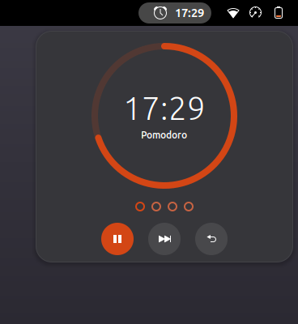
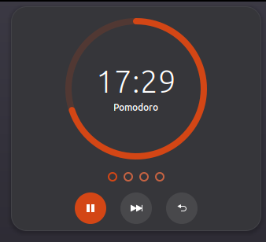
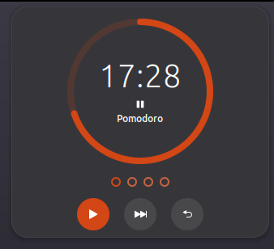
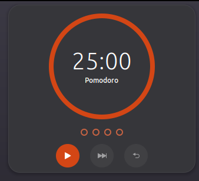
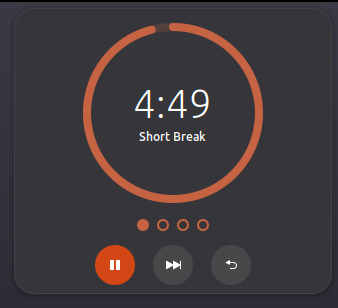
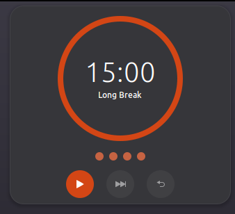
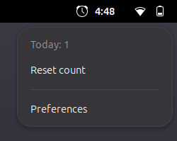
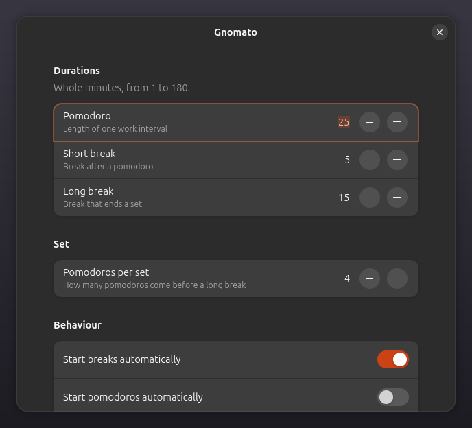

# Gnomato

<p align="center">
  
</p>

<p align="center">
  <a href="metadata.json"></a>
  <a href="LICENSE"></a>
</p>

A Pomodoro timer for the GNOME Shell panel: one interval at a time — a pomodoro,
a short break or a long break — with the countdown visible at a glance and a
journal of what actually happened.

An interval is a commitment on the wall clock: it ends at `start + length`
regardless of suspend, screen lock or whether you were at the keyboard. If the
deadline passes while the timer is not running, the interval is closed and
marked `restored` in the journal. See
[docs/adr/0001-wall-clock-interval-semantics.md](docs/adr/0001-wall-clock-interval-semantics.md).

| | |
|---|---|
| Panel | Countdown while an interval runs, a pause mark while it is paused, the icon alone when idle |
| Popup | Left click: a countdown ring, the interval in words, the set as a row of tomatoes, and start/pause, skip and reset as round buttons |
| Menu | Right click: today's finished pomodoros, the way to reset that count, and Preferences |
| Intervals | Configurable pomodoro and break lengths, a set of N pomodoros ending in a long break |
| Behaviour | Breaks start themselves, pomodoros do not; a finished interval ends with a banner and announces the next one with its own cue (an alarm for a pomodoro, a chime for a break), while an interval you start by hand is silent |
| Journal | Append-only JSONL of finished, skipped and interrupted intervals, and of count resets |
| Keys | Optional global shortcuts, unassigned by default |

## Screenshots

The panel when idle, counting down, paused, and counting down a break.

<p align="center">
  
  
</p>
<p align="center">
  
  
</p>

The popup: a pomodoro running, the same interval paused with the ring held where
it stopped, and the plan for the next interval while nothing is running.

<p align="center">
  
  
  
</p>

A break wears its own colour and says which one it is; the long break ends the
set with all four slots spent; the right click gives the day's count and the way
to reset it.

<p align="center">
  
  
  
</p>

Preferences cover the durations, the set and its size, the behaviour, the
shortcuts and the journal path.

<p align="center">
  
</p>

The screenshots are of the real extension, at the sizes the shell draws it.

## Requirements

- GNOME Shell 50 (developed and tested on 50.1)
- `gnome-shell >= 50` for the package

## Install

```sh
./build-deb.sh
sudo dpkg -i dist/gnomato_0.2.0_all.deb
gnome-extensions enable gnomato@fstronin.github.io
```

On Wayland a new extension is only picked up by a freshly started shell, so log
out and back in after installing. Check the result with:

```sh
gnome-extensions info gnomato@fstronin.github.io   # State: ACTIVE
```

Preferences (durations, set size, behaviour, shortcuts, journal path):

```sh
gnome-extensions prefs gnomato@fstronin.github.io
```

The package installs to
`/usr/share/gnome-shell/extensions/gnomato@fstronin.github.io/`, compiles the GSettings
schema into that directory at build time and needs no post-install step.

## Journal

Finished intervals are appended to `~/.local/state/gnomato/journal.jsonl`
(one JSON object per line; an interval crossing local midnight is written
twice, and only its first part counts as a pomodoro for that day). Resetting the
day's count appends a mark to the same file instead of deleting anything, so the
count stays a reading of the record. Nothing rotates the file: it grows by
roughly a hundred bytes per interval, and deleting it only loses history. Point
`XDG_STATE_HOME` elsewhere if you want it somewhere else.

## Development

The extension directory *is* the repository root: `metadata.json`,
`extension.js`, `prefs.js`, `stylesheet.css`, `lib/`, `ui/`, `schemas/`.

```sh
glib-compile-schemas schemas/            # after editing the schema
gjs -m tests/run-tests.js                # unit tests for lib/, no shell needed
```

Install the working tree for the current user — only the extension itself
belongs in the shell's extension directory. `--delete-excluded` is what
actually removes anything already sitting there that is not part of the
extension: a plain `--delete` protects excluded paths from deletion.

```sh
rsync -a --delete --delete-excluded \
      --exclude .git --exclude .gitignore --exclude .superpowers \
      --exclude docs --exclude tests --exclude tools --exclude CONTEXT.md --exclude AGENTS.md \
      --exclude debian --exclude dist --exclude '*.deb' --exclude .scratch \
      --exclude README.md --exclude build-deb.sh \
      ./ ~/.local/share/gnome-shell/extensions/gnomato@fstronin.github.io/
gnome-extensions enable gnomato@fstronin.github.io
```

What lands there is the extension payload and `LICENSE`: `metadata.json`,
`extension.js`, `prefs.js`, `stylesheet.css`, `lib/`, `ui/`, `schemas/`,
`LICENSE`.

Then, in order of how much they change:

- `gnome-extensions disable gnomato@fstronin.github.io && gnome-extensions enable gnomato@fstronin.github.io`
  re-runs `enable()`/`disable()`. That is enough for `stylesheet.css` — the shell
  reloads it on every enable, so the look of the popup can be iterated without a
  new session — and for anything else except the modules themselves.
- Editing `extension.js`, `lib/` or `ui/` needs a new shell process: on Wayland
  that means logging out and back in. The ESM module cache cannot be flushed and
  `gnome-extensions` has no reload command.

Two things to know about this machine specifically:

- `gnome-extensions pack` takes only `metadata.json`, `extension.js`, `prefs.js`,
  `stylesheet.css`, `schemas/` and `locale/` by default, so the bundle is missing
  `lib/` and `ui/` unless they are named: `--extra-source=lib --extra-source=ui`.
  Such a bundle looks complete and fails to import inside the shell. The upload
  we ship is built this way — see `docs/PUBLISHING.md`.
- The same uuid in `~/.local/share/gnome-shell/extensions/` and
  `/usr/share/gnome-shell/extensions/` is not an error: the shell logs
  "already installed in user dir … will not be loaded" and runs the user copy,
  ignoring the package. A development copy therefore shadows an installed
  package, and the two drift apart silently.

### Screenshots

`docs/images/` is generated, not drawn. `tools/screenshots/run.sh` starts a
headless GNOME Shell whose only output is a virtual monitor, loads the real
extension into it together with a throwaway probe, poses each state and crops
the compositor's own output:

```sh
tools/screenshots/run.sh                 # the set the README uses, ~10 minutes
MODE=quick tools/screenshots/run.sh      # same poses, no wait, to check the rig
```

The wait is real: the headline shot is a default-length pomodoro part way
through, and the day's count comes from a real finished interval. The shell
runs with a private `XDG_RUNTIME_DIR` and a keyfile settings backend, so the
real session is never touched.

## Design

- `CONTEXT.md` — the vocabulary (Pomodoro, Break, Interval, Set, Timer, Journal)
- `docs/spec.md` — the settled design, environment facts and what is out of scope
- `docs/PUBLISHING.md` — building and uploading a version to extensions.gnome.org
- `docs/adr/` — decisions that are expensive to reverse, with the reasoning
- `docs/superpowers/plans/` — the implementation plan this code was built from

## License

GPL-2.0 (see `LICENSE`).
